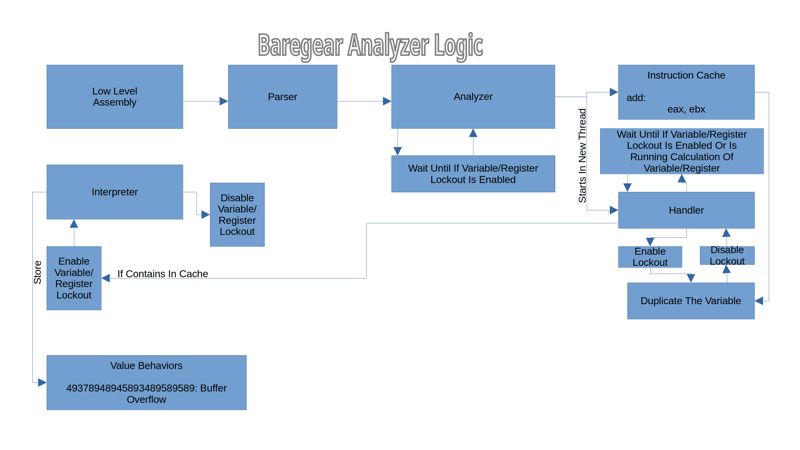

Implementing Analyzer
=====================

The Code Analyzer Logic Is Analyze The Code Deeper With Low Level Assembly
Instruction Simulation And Queue The Calculation/Heavy Instruction
In The Another Thread To Detect The Undefined Software Behavior
In Multiple Threads And Return The Behavior For Implementing Crash
Prevention. For Example:

And In Case Value Input Is Dynamic Of Function
To Extract The Risky Values By Calculating
Using Reversed Formula.